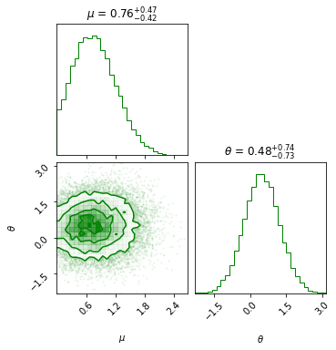

# pyhf_llh

A wrapper for `pyhf` likelihoods that supports `jax` jit compilation.

### Installation

`pyhf_llh` requires 
- `JAX` (Linux and iOS support only)
- `pyhf`

Running the demo code (`batty`) requires additionally 
- `batty` [here](https://github.com/bat/batty)
- `priorhf` [here](https://github.com/gazot/priorhf) 

**Note:** 
- Run each snippet in a separate Python script! (jupter notebook saves variables, which can cause issues)
- HMC is not working for Gamma distributed priors yet (`2_bin_uncorr`)

### `pyhf` log likelihood without jax


```python
from pyhf_llh import *

file = '../models/2_bin_uncorr.json'
llh = pyhf_llh(file)        # Float64 precision

# llh argument must be array-like
param = [2, 1, 1]
print('llh:', llh(param)) 
```

### `pyhf` log likelihood with jax


```python
import pyhf
from pyhf_llh import *

# set the jax backend for pyhf (required!)
pyhf.set_backend('jax')

file = '../models/2_bin_uncorr.json'
llh, llh_grad = pyhf_llh_with_grad(file)        # Float32 precision

# llh_with_grad requires np.arrays of type float
param = np.array([2., 1., 1.])
print('llh_with_grad:', llh_grad(param)) 
```

### Bayesian Inference with `batty` (HMC)


```python
import pyhf
from batty import BAT_sampler, BAT, Distributions, jl
from pyhf_llh import *
from priorhf import make_prior

# set the jax backend for pyhf (required!)
pyhf.set_backend('jax')

file = '../models/2_bin_corr.json'
# priors
_, prior_spec = make_prior(file)
# batty (for now) only works for flat vector priors
priors = list(prior_spec.values())  

# likelihood
llh, llh_grad = pyhf_llh_with_grad(file)        # Float32 precision

# BAT sampler
sampler = BAT_sampler(prior_specs=priors, llh=llh, llh_and_grad=llh_grad)

sampler.sample(strategy=BAT.MCMCSampling(mcalg=BAT.HamiltonianMC(), nsteps=10_000, nchains=2))
```


```python
kwargs = dict(labels=[r'$\mu$', r'$\theta$'], show_titles=True, bins=30)
sampler.corner(**kwargs, color='green');
```


    

    

